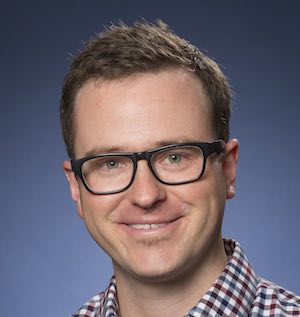

## Welcome

Welcome! You have reached the homepage of Dr. Mike Janssen, Associate Professor of Mathematics at [Dordt University](http://dordt.edu).

## Teaching

I have taught a wide variety of mathematics courses throughout my 10 years in higher education. I am persuaded that my courses should not only create space in which students learn interesting mathematics, but that they should give students the experience of _doing_ mathematics. I want them to deeply understand that mathematics is a cultural activity practiced by particular people in a particular time and place. Thus, I want my students to experience mathematics as working mathematicians do: the questioning, the struggle, and ultimately, the joy of discovery.

To that end, I incorporate [active/inquiry-based learning](http://www.inquirybasedlearning.org) in all of my classes. The particular type of active learning depends a great deal on the students and the class, but students who take part in my courses should know that they will be expected to dig deeply, struggle, and learn a lot. 

I am also interested in the use of mastery grading (specifications and standards-based) in my courses to encourage a growth mindset and student mastery of core concepts.

For more, see my [teaching page](teaching) or my [teaching statement](https://www.dropbox.com/s/3plee4amayrz5u8/mkj-teachingstatement.pdf?dl=0).

## Research Interests

My research interests are varied. Mathematically, they could broadly be described as exploring the connections between commutative algebra (usually symbolic powers of homogeneous ideals) and other areas of mathematics, including algebraic geometry and graph theory. A unifying question in my work explores the relationship between the $m$th symbolic power $I^{(m)}$ of an ideal $I$ and its $r$th ordinary power $I^r$.

For more, including a list of talks and publications, see my [research page](research). For a detailed description of past, ongoing, and future work, see my [research statement](https://www.dropbox.com/s/ilqowk6keucpzet/mkj-researchstatement.pdf?dl=0).

---
This is a jekyll based resume template. You can find the full source code on [GitHub](https://github.com/bk2dcradle/researcher)